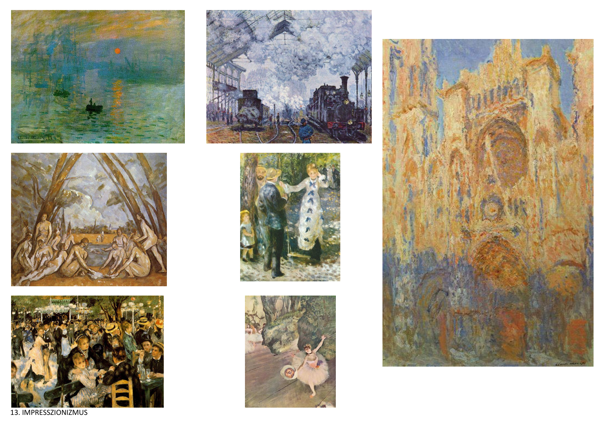

# 14A - Az impresszionista és posztimpresszionista festészet

Mutassa be az impresszionista és posztimpresszionista festészet stílusjegyeit, alkotóit és műveit! Ismertesse a Nagybányai művésztelep tagjainak tevékenységét!

- A 19. századvégi művészet célkitűzései, törekvései, plein air festészete
- Az impresszionizmus és posztimpresszionizmus  nagymestereinek  művészete
- A századvégi stílusirányzatok magyar képviselői

## 1. A 19. századvégi művészet történelmi háttérja

### 1.1 Időszak és előzmények
- **Időszak**: XIX. század második fele - XX. század eleje (1850-1910)
- **Előzmény**: a Barbizoni iskola plein-air tájképfestészete
- **Társadalmi változások** → ipari forradalom, városfejlődés
- **Technikai újítások** → festékek, ecsetek fejlődése
- **Fotográfia** → a valóság más módon való rögzítése

### 1.2 Művészeti körülmények
- **Akadémikus művészet** → hivatalos művészeti oktatás
- **Szalonok** → hivatalos kiállítások
- **Művészcsoportok** → független művészek
- **Kritika** → művészeti vélemények

## 2. Az impresszionista festészet

### 2.1 Alapelvek és jellemzők
- **Francia festők által indított irányzat** → Párizs központja
- **Pillanatnyi impressziók** → futó benyomások rögzítése
- **Optikai színkeverés** → színek optikai keveredése
- **Oldott, könnyed ecsetvonások** → finom ecsetkezelés
- **A színek telítettsége és reflexei** → élénk színek

### 2.2 Technikai jellemzők
- **Színes árnyékok** → a hagyományos fekete árnyékok helyett
- **Kontúr- és vonalperspektíva nélküli ábrázolás** → síkfelületi megjelenés
- **Vibráló tónusok** → mozgó színek
- **Szubjektív látásmód** → egyéni látás
- **A látvány változásának követése** → fény változások

### 2.3 Fény és szín kezelése
- **A természetes fény élénk kontrasztjai** → fény hatások
- **A fény, levegő, a színek telítettségének megmutatása** → valőr
- **A visszatükröződő színek** → reflex színek
- **Dekomponáltság** → színek felbontása
- **Kifutó képkivágás** → nem teljes kompozíció

## 3. Híres impresszionista festők és műveik

### 3.1 Claude Monet
- **A felkelő nap impressziója** → az impresszionizmus névadó műve
- **A roueni katedrális** → reggel, délben (fény változások)
- **Stílusjegyek** → fény és szín kutatása

### 3.2 Pierre Auguste Renoir
- **A hinta** → emberi jelenetek
- **Esernyők** → városi élet
- **Moulin de la Galette** → párizsi élet

### 3.3 Edgar Degas
- **Táncosnők** → balett témák
- **Stílusjegyek** → mozgás ábrázolása

### 3.4 Édouard Manet
- **Reggeli a szabadban** → világi témák
- **Táncosnő** → portrék
- **Monet műterme** → művészi környezet

## 4. A posztimpresszionizmus

### 4.1 Alapelvek és jellemzők
- **Nem jelent egységes stílust** → különböző irányzatok
- **Az impresszionizmust követő törekvések** → további fejlődés
- **Szimbolikus festészet** → szimbolikus tartalom
- **Pointillizmus** → pontokkal való festés
- **Tudományos impresszionizmus** → tudományos megközelítés

### 4.2 Divizionizmus
- **A felület optikai törvényeinek szisztematikus kutatása** → tudományos alapok
- **Pontokkal való festés** → optikai keveredés
- **Színek felbontása** → színelmélet

### 4.3 Nabis csoport
- **"Próféták" festőcsoport** → francia művészek
- **Pierre Bonnard** → nabi festő
- **Csók István** → magyar nabi festő
- **Vasary János** → magyar nabi festő
- **Gresham-kör** → magyar művészek

## 5. Híres posztimpresszionista festők

### 5.1 Paul Cézanne
- **Almák és narancsok** → csendéletek
- **Stílusjegyek** → komplementer színpárok, szimultán kontraszt, kontúrozás
- **A formák állandó értékeinek megmutatása** → geometrikus formák

### 5.2 Paul Gauguin
- **Fekete sertések** → egzotikus témák
- **Tahiti nők piros gyümölccsel** → trópusi élet
- **Stílusjegyek** → szimbolikus tartalmak

### 5.3 Vincent van Gogh
- **Napraforgók** → természeti témák
- **Kalapos önarckép** → portrék
- **Arles-i szoba** → belső terek
- **Stílusjegyek** → izgatott, vibráló ecsetvonások

### 5.4 Többi posztimpresszionista
- **Paul Signac** → Az antibes-i világítótorony
- **Henry de Toulouse-Lautrec** → A Moulin Rouge-ban

## 6. A Nagybányai festőiskola

### 6.1 Történelmi háttér
- **Az impresszionizmus magyar iskolája** → hazai impresszionizmus
- **Harc a hivatalos, akadémikus festészet ellen** → függetlenség
- **A szecesszió hatása** → modern irányzatok
- **Erős színkontrasztok** → élénk színek

### 6.2 Stílusjegyek
- **Vibráló felületek játéka** → mozgó színek
- **Átlós, újszerű kompozíciók** → modern kompozíció
- **Plein air festés** → szabadban való festés
- **A fényhatások élénk kontrasztjai** → fény kontrasztok
- **Természetes beállítások keresése** → valósághűség

### 6.3 Híres nagybányai festők és műveik
- **Koszta József** → Kukoricatörés
- **Ferenczy Károly** → Napos délelőtt, Festőnő
- **Fényes Adolf** → Kisvárosi délelőtt
- **Iványi Grünwald Béla** → Itatás
- **Rippl-Rónai József** → A körtvélyesi kastély
- **Hollósy Simon** → Tengeri hántás, Szénaboglyák
- **Thorma János** → Tavaszi táj

### 6.4 Technikai jellemzők
- **Gazdag színhasználat** → sokféle szín
- **Reflex színek** → visszatükröződő színek
- **Figurális impresszionizmus** → emberi alakok
- **Pasztózus ecsetkezelés** → vastag festékréteg
- **A természet lírai megközelítése** → költői hangulat

## 7. Az impresszionizmus és posztimpresszionizmus hatása

### 7.1 Művészeti hatás
- **Modern festészet** → XX. századi irányzatok
- **Fauvizmus** → színek kiemelése
- **Expresszionizmus** → érzelmek kifejezése
- **Kubizmus** → geometrikus formák

### 7.2 Kulturális örökség
- **Fény és szín kutatása** → optikai kutatások
- **Szabad festészet** → független művészet
- **Természet utánzás** → plein air festészet
- **Művészcsoportok** → független művészek

### 7.3 Modern hatás
- **Neoimpresszionizmus** → XX. századi újjáéledés
- **Történelmi rekonstrukció** → impresszionista művek
- **Művészettörténet** → tudományos kutatás
- **Turizmus** → impresszionista emlékek látogatása

---

### **Felső sor**

- **Claude Monet – Impresszió, a felkelő nap** (Impression, soleil levant, 1872) → Ez a festmény adta a nevet az impresszionizmusnak.
- **Claude Monet – Saint-Lazare pályaudvar** (1877) → A modern városi élet és az ipari forradalom ábrázolása a fény és füst hatásaival.
- **Claude Monet – Roueni katedrális sorozat** (1892–94) → Monet több tucat képet festett a katedrálisról, különböző napszakok és fényhatások bemutatására.

### **Középső sor**

- **Paul Cézanne – Fürdőzők** (Les Grandes Baigneuses, 1898–1905) → Bár Cézanne nem volt klasszikus impresszionista, ő kötötte össze az impresszionizmust a posztimpresszionizmussal.
- **Pierre-Auguste Renoir – Séta** (La Promenade, 1870) → Könnyed társas jelenet, lágy színekkel és fényekkel.

### **Alsó sor**

- **Pierre-Auguste Renoir – A Moulin de la Galette mulató** (1876) → Az impresszionizmus egyik legismertebb festménye, a párizsi Montmartre életképével.
- **Edgar Degas – Balettóra** (1874 körül) → Degas a mozgás, különösen a balett világának mesteri ábrázolója volt.

### **Felső sor**

- **Vincent van Gogh – Csillagos éj** (Starry Night, 1889) → Az egyik legismertebb posztimpresszionista festmény, a dinamizmus és érzelmi kifejezés mintapéldája.
- **Vincent van Gogh – Éjjeli kávéház terasza** (Café Terrace at Night, 1888) → Élénk színek és jellegzetes ecsetvonások.
- **Vincent van Gogh – Hálószoba Arles-ban** (Bedroom in Arles, 1888) → A személyes tér egyszerű, de erőteljes színvilágú ábrázolása.

### **Alsó sor**

- **Vincent van Gogh – Napraforgók** (Sunflowers, 1888) → A híres virágcsendélet-sorozat egyik darabja.
- **Vincent van Gogh – Auvers-i templom** (Church at Auvers, 1890) → A vibráló színek és mozgás kifejező ereje jellemzi.
- **Georges Seurat – Vasárnap délután a Grande Jatte szigetén** (A Sunday Afternoon on the Island of La Grande Jatte, 1884–86) → A pointillizmus (neoimpresszionizmus) alapműve, apró színpöttyökből építve.

