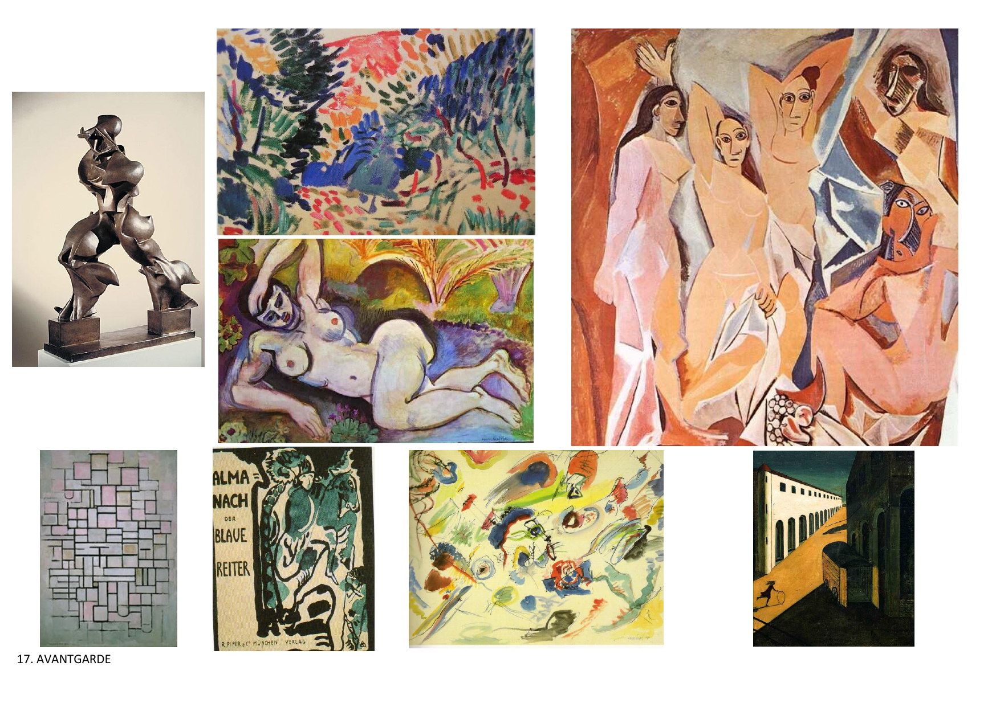

# 17A - A futurizmus, konstruktivizmus, dadaizmus és szürrealizmus

## 1. A 20. század eleji avantgárd művészeti irányzatok

### 1.1 Társadalmi környezet
- **A századvégi társadalmi válság felerősödése** → társadalmi problémák
- **Szociális témák** → társadalmi kérdések
- **Több új irányzat egyidejű megjelenése** → párhuzamos mozgalmak
- **Rövid idejű, forradalmi lendületű mozgalmak** → intenzív, de rövid életű

### 1.2 Művészeti alapelvek
- **A művészetről alkotott kép megváltoztatása** → új művészeti koncepció
- **Lázadás** → hagyományok ellen
- **Szakítás a hagyományokkal** → múlt elutasítása
- **Szakítás a közönséggel** → néző elutasítása
- **A megszokott művészeti formák széttörése** → forma bontás

### 1.3 Művészeti célok
- **Új kifejezésformák keresése** → új technikák
- **Formabontó vagy formaépítő szándék** → forma kezelése
- **Közzétett elvi nyilatkozatok** → manifesztumok
- **Művészeti programok** → elvi alapok

## 2. A futurizmus

### 2.1 Alapelvek és jellemzők
- **Olaszország és Oroszország** → fő központok
- **Művészeti-politikai hitvallás** → politikai program
- **A múlt tagadása** → történelem elutasítása
- **A jövő kiemelése** → jövő orientáció
- **Militarizmus** → háborús témák
- **A sebesség, a technika dicsőítése** → modernitás

### 2.2 Művészeti jellemzők
- **A képzőművészetben a mozgás fázisok egymást követő ábrázolása egy képen** → mozgás ábrázolása
- **A mozgás irányának érzékeltetése** → dinamika
- **Az erővonalak feltüntetése a képen** → erő kifejezése
- **Hatása a festészeten kívüli területeken** → több művészeti ág

### 2.3 Művészeti területek
- **Könyvművészet** → tipográfia
- **Grafika** → nyomtatott művészet
- **Tipográfia** → betűkép
- **Zene** → hangzás
- **Előadóművészetek** → színház

### 2.4 Híres futuristák és művek
- **Tommaso Marinetti** → Futurista Kiáltvány ("bátorság, vakmerőség, felháborodás")
- **Vlagyimir Majakovszkij** → orosz szellemi vezéralak
- **Umberto Boccioni** → A kerékpáros dinamizmusa
- **Marcel Duchamp** → Lépcsőn lemenő akt
- **Giacomo Balla** → Kutya pórázon, Fecskék

## 3. A konstruktivizmus

### 3.1 Alapelvek és jellemzők
- **Realista Manifesztum** → elvi alapok
- **Az orosz futurizmus hatott** → előfutár
- **Az absztrakt irányzat kibontakoztatására** → absztrakció
- **A művészeknek művészeten túli szerepet szánt** → társadalmi szerep
- **Mint történelmi felelősség, küldetéstudat** → politikai program

### 3.2 Művészeti jellemzők
- **Különböző anyagok alkalmazása** → fa, üveg, vas, cement
- **A tömegek és formák viszonyának megjelenítése** → térbeli kapcsolatok
- **Geometrikus formák előtérbe helyezése** → geometria
- **A szerkezeti összetevők, terek és síkok erőteljes hangsúlyozása** → szerkezet
- **Funkcionalizmus** → hasznosság

### 3.3 Híres konstruktivista művészek és művek
- **Vlagyimir Tatlin** → 3. Internacionálé tornya (terv)
- **Naum Gabo** → Női fej
- **Antoine Pevsner** → Negyedik dimenzió
- **Kazimir Malevics** → szuprematizmus

### 3.4 Magyar konstruktivizmus
- **Kassák Lajos** → "Nem tudunk többé elhelyezkedni az adott keretek között sem a társadalomban, sem a művészetben. Nem akarunk a régiből újat komponálni. A mi korunk a konstruktivisták kora. Művészet, tudomány, technika egy ponton érintkeznek. Az új forma az architektúra."

## 4. A dadaizmus

### 4.1 Alapelvek és jellemzők
- **A tagadás művészete** → nihilizmus
- **Lelki magatartás: nihilista és abszurd** → erkölcsi hanyatlás
- **Eszméi, földrajzi elterjedése** → Zürich, Németország, New York, Párizs, Szovjetúnió
- **Új műformák és kifejezésmódok megalapozása** → forradalmi megközelítés

### 4.2 Művészeti technikák
- **Ready made** → kész tárgyak
- **Kollázs** → különböző anyagok összeragasztása
- **Fotómontázs** → fényképek összeillesztése
- **Objet trouvé** → talált tárgyak konstrukciója

### 4.3 Híres dadaisták és művek
- **Tristan Tzara** → Hét Dada Kiáltvány
- **Hans Arp** → dadaista művész
- **Marcel Duchamp** → Palackszáritó, Forrás

### 4.4 Dadaista művészeti formák
- **Performance** → előadásművészet
- **Ready made** → kész tárgyak
- **Object art** → tárgy művészet
- **Kollázs** → összeillesztés

## 5. A szürrealizmus

### 5.1 Alapelvek és jellemzők
- **Eszméi** → André Breton
- **Pszichológiai háttere** → Sigmund Freud
- **Az álomvilág** → tudatalatti
- **A fantázia** → képzelet
- **Az irracionális** → logika nélküli

### 5.2 Híres szürrealista művészek és művek
- **Henri Rousseau** → Az álom
- **Salvador Dalí** → Elfolyó idő
- **Joan Miró** → Katalán táj
- **Marc Chagall** → A muzsikus

### 5.3 Szürrealista technikák
- **Automatikus rajz** → tudatalatti rajz
- **Frottázs** → dörzsölés
- **Grattage** → kaparás
- **Dekalkománia** → átvitel

## 6. Az absztrakt művészet

### 6.1 Alapelvek és jellemzők
- **A természetábrázolás elvetése** → valóság elhagyása
- **Nem ábrázoló, nonfiguratív, abszolút művészet** → absztrakt tartalom
- **Önállósuló formaelemek** → forma elemek
- **A vonal, a forma, a mozgás, a szín kiemelt szerepe** → alapvető elemek
- **Új lehetőségek a művészi alkotófolyamat számára** → kreativitás

### 6.2 Művészeti jellemzők
- **Kibővített képzőművészeti formanyelv** → új nyelv
- **Hatása a modern építészetre** → építészet
- **Hatása az iparművészetre** → iparművészet
- **Hatása a díszítőművészetre** → díszítőművészet

### 6.3 Híres absztrakt művészek
- **Vaszilij Kandinszkij** → absztrakt művészet alapítója
- **Kazimir Malevics** → szuprematizmus
- **Piet Mondrian** → neoplasticizmus

## 7. Az avantgárd művészet hatása és öröksége

### 7.1 Művészeti hatás
- **Modern művészet** → XX. századi irányzatok
- **Absztrakt művészet** → absztrakció
- **Konceptuális művészet** → eszmei tartalom
- **Performansz művészet** → előadásművészet

### 7.2 Kulturális örökség
- **Művészeti forradalom** → művészet megváltozása
- **Új kifejezésformák** → új technikák
- **Egyéni látásmód** → szubjektivitás
- **Művészeti szabadság** → függetlenség

### 7.3 Modern hatás
- **Kortárs művészet** → mai művészet
- **Művészettörténet** → tudományos kutatás
- **Múzeumok** → avantgárd gyűjtemények
- **Oktatás** → művészeti iskolák
- **Kulturális örökség** → műemlékek védelme

---

